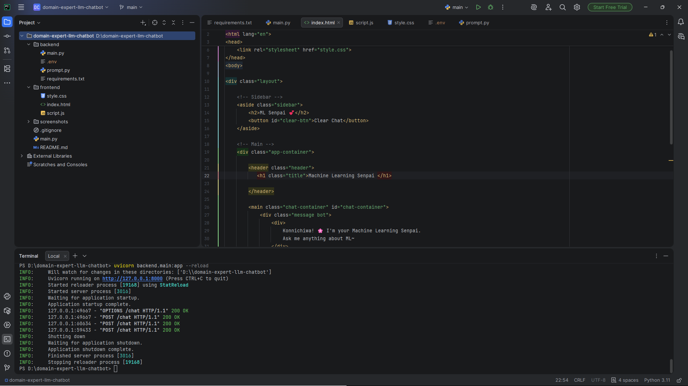
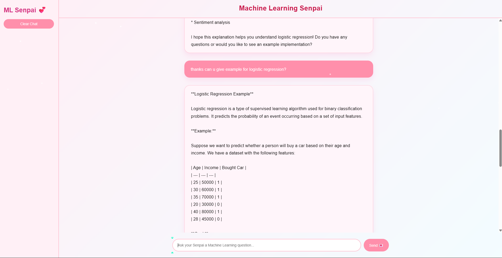

# 🧠 Domain Expert LLM Chatbot

A full-stack AI chatbot designed to act as a Machine Learning domain expert.  
The system integrates a real LLM API with a structured FastAPI backend and a responsive frontend interface.

---

## 🚀 Overview

The Domain Expert LLM Chatbot is a session-aware AI assistant that:

- Answers Machine Learning theory and project-related questions
- Maintains short-term conversational context
- Uses prompt engineering (no fine-tuning)
- Integrates with a live LLM API (Groq)
- Implements a clean full-stack architecture

This project demonstrates backend design, API integration, session handling, and UI system design.

---

## 🏗️ System Architecture

Frontend (HTML/CSS/JavaScript)  
⬇  
FastAPI Backend (`/chat` REST endpoint)  
⬇  
Prompt Engineering Layer  
⬇  
Groq LLM API (Llama 3.1 Instant)  

---

## 📂 Project Structure

```
domain-expert-llm-chatbot/
│
├── backend/
│   ├── main.py
│   ├── prompt.py
│   └── .env
│
├── frontend/
│   ├── index.html
│   ├── style.css
│   └── script.js
│
└── README.md
```

---

## 🧠 Key Features

### ✅ Prompt-Engineered ML Expert
- System prompt enforces domain restriction
- Structured explanations
- Focus on correctness and clarity

### ✅ Session-Based Memory
- Cookie-based session ID
- Maintains last 10 message exchanges
- Prevents cross-user conversation leakage

### ✅ Full-Stack Integration
- REST API design
- Asynchronous frontend fetch
- JSON request/response handling

### ✅ Clean UI Implementation
- Structured layout
- Dynamic message rendering
- Typing indicator
- Clear chat functionality

---

## ⚙️ Technologies Used

### Backend
- Python
- FastAPI
- Requests
- Pydantic

### Frontend
- HTML5
- CSS3
- Vanilla JavaScript

### LLM Provider
- Groq API
- Model: `llama-3.1-8b-instant`

---

## 🔐 Environment Setup

Create a `.env` file inside the `backend/` folder:

```
LLM_API_KEY=your_groq_key_here
LLM_API_URL=https://api.groq.com/openai/v1/chat/completions
```

---

## ▶️ Running the Project

### 1️⃣ Install Dependencies

```
pip install fastapi uvicorn python-dotenv requests
```

### 2️⃣ Start Backend

From project root:

```
uvicorn backend.main:app --reload
```

### 3️⃣ Open Frontend

Open:

```
frontend/index.html
```

---

## 📌 Example Use Cases

- Explaining bias-variance tradeoff
- Comparing optimization algorithms
- Discussing regularization methods
- Reviewing ML project approaches
- Clarifying exam-related ML concepts

---

## 🧩 Design Decisions

- No fine-tuning → Prompt engineering only
- No database → In-memory session store (MVP)
- Context trimming → Last 10 messages only
- Clean modular structure for scalability

---

## 📸 Screenshots

### 🖥️ Project Structure



### 💬 Chat Interaction Example


.png)

---


## 📊 Architecture Diagram

```
User (Browser)
      │
      ▼
Frontend (HTML/CSS/JS)
      │
      ▼
FastAPI Backend (/chat endpoint)
      │
      ▼
Prompt Engineering Layer
      │
      ▼
Groq LLM API (llama-3.1-8b-instant)
```

---
## 🚀 Future Improvements

- Persistent database-backed memory
- Authentication system
- Markdown rendering
- Multi-domain expert modes
- Deployment to cloud platform

---

## 📄 License

This project is for educational and portfolio purposes.

